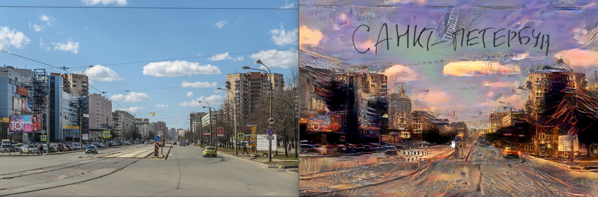
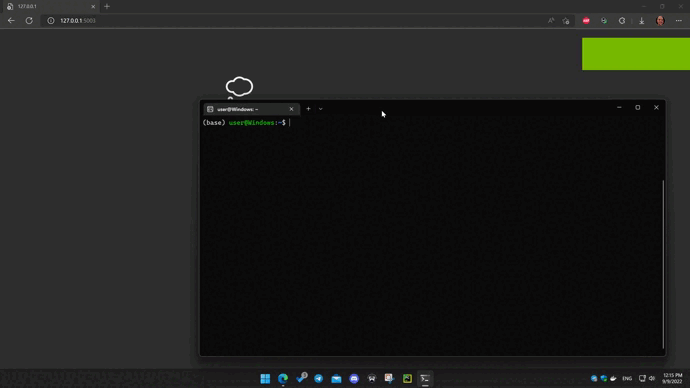
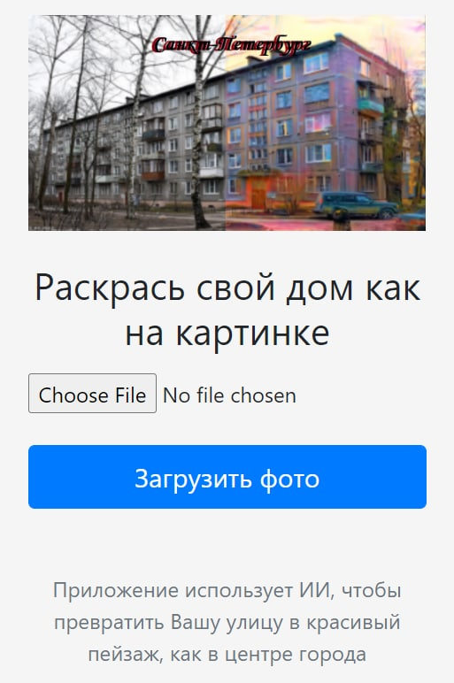

# Generating beautiful postcards from a user image

  

St. Petersburg is a big city and is not limited to Nevsky Prospekt and the Hermitage.
Today we give every resident of the city the opportunity to make a postcard with their house or street.

You can use our service to upload your photo and then the neural network will do its magic.  
As a result, you will receive a beautiful image that can be printed, hung on the wall, sent as a postcard or posted on your page on the social network.  

Work demonstration  
---
  

Main page  
---
  
